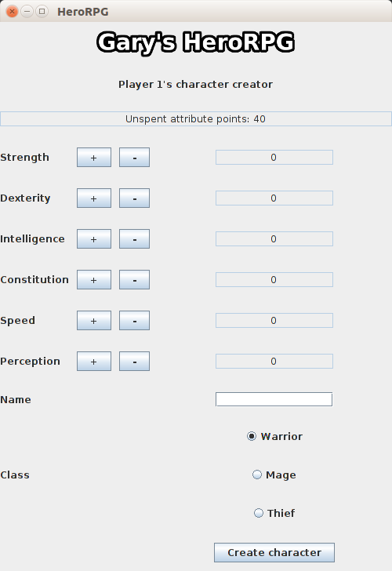
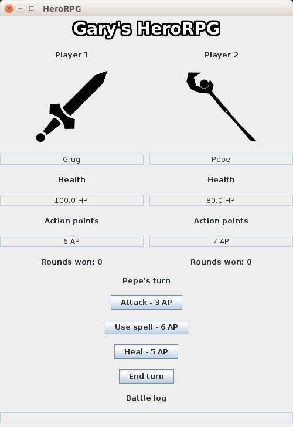

A two player game written in Java using the Swing framework. Loosely based on Divinity: Original Sin, the players first need 
to create their characters by distributing their available points on six attributes, and by choosing their hero's class. The 
attributes determine the characters' stats, and the different classes have different skills.

After they are created, the heroes must fight each other. The battle itself is turn-based, with both characters having action
points to spend to use their skills: attacking, using a spell or healing. The player who survives wins the round. Whoever gets
to three victorious rounds wins the battle.

